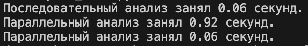
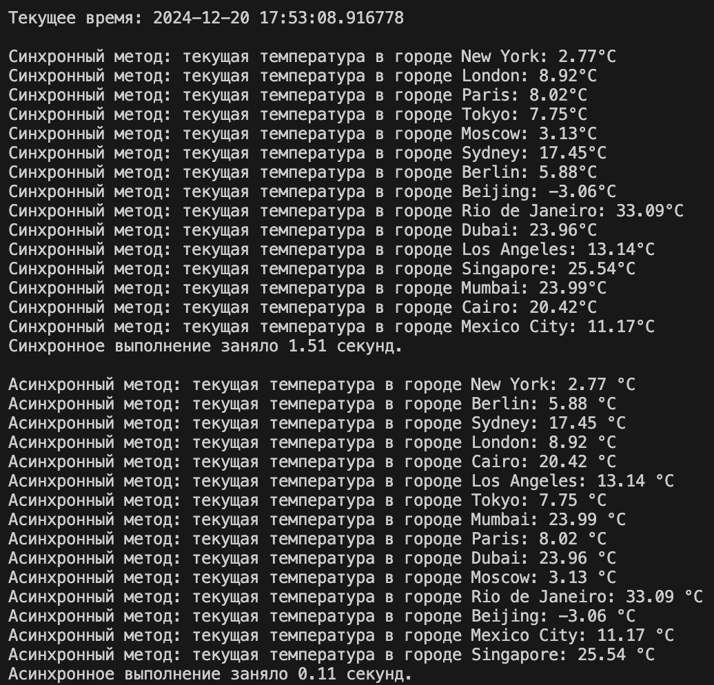

# ДЗ-1 продвинутый python ИИ24
Сушкова Дарья Сергеевна
### Cтруктура проекта
Код расположен в директории `\weather_analysis`:
- `analyzer.py`: основные функции сервиса по анализу / получению температуры;
- `plot_func.py`: функции отрисовки статистических визуализаций;
- `app.py`: интерфейс Streamlit приложения;
- `test_func.py`: сравнение распараллеливания, асинхронных методов из текста задания.

В директории `\optional` расположены дополнительные файлы - пример датафрейма с температурами и скриншоты выполнения работы.
### Распараллеливание выполнения анализа
Распараллеливание реализовано двумя способами:
- Многопроцессорность (`multiprocessing`): создаёт отдельные процессы для каждой задачи - анализа временного ряда конкретного города;
- Многопоточность (`threading`): использует несколько потоков внутри одного процесса.

Сравнение подходов производится на примере сгенерированных данных в `optional/temperature_data.csv` по времени выполнения для всех представленных городов. В сравнении с последовательным выполнением многопроцессорность сильно хуже из-за того, что требуется больше времени на создание и обмен данными между процессами. А многопоточность заняла столько же времени, так как снижаются накладные расходы на создание новых процессов. 
 
В целом, буста от распараллеливания на сгенерированном примере не выявлено.

### Получение текущей температуры
Сравнение синхронного и асинхронного подходов получения текущей температуры из OpenWeatherMap API производится на примере сгенерированных данных в `optional/temperature_data.csv`.
 
Как видим, асинхронное выполнение сработало практически моментально, а синхронное заняло полторы секунды. При этом порядок выдачи результатов запросов в асинхронном подходе не обязательно совпадает с исходным перечнем городов из-за распараллеливания; на корректность сопоставления температуры городам это не влияет. 
В итоге, распараллеливание в рамках выполнения HTTP-запросов на сгенерированном примере дало значительный буст.

### Дополнительные уточнения
- Приложение Streamlit имеет неширокий формат веб-страницы, так как при настройке `layout="wide"` графики получаются растянутыми, что выглядит негармонично в рамках общего интерфейса;
- Проверка "нормальности" текущей температуры происходит по принципу попадания в диапазон $\text{среднее}\pm 2\sigma$, рассчитанный на статистиках, вычисленных в рамках профилей сезонов заданного города. Вызов проверки для нескольких городов можно найти в `weather_analysis/test_func.py`. Большая часть запусков проверок текущей температуры для нескольких городов не содержала аномалий.